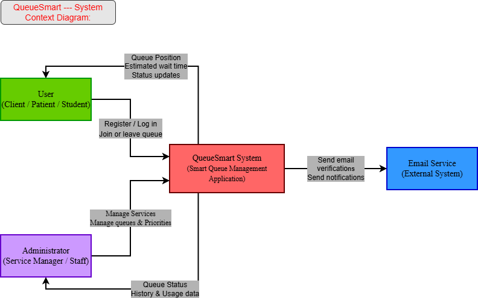

# QueueSmart – Assignment 1

## 1. Initial Thoughts

### 1.1 Main Users of the System

QueueSmart serves two primary user segments, each with distinct needs and workflows:

**End-Users (Clients / Students / Patients):**  
Individuals seeking service at student centers, clinics, or help desks who want to minimize physical waiting and gain transparency into wait times.

**Administrators (Staff / Service Managers):**  
Personnel responsible for operating service counters, managing service catalog definitions, and monitoring live queue flow to optimize efficiency.

### 1.2 User and Administrator Interaction

**End-User Experience:**  
Users will interact with a responsive web or mobile interface to register, browse available services, join or leave queues remotely, and monitor their live position and dynamic wait time.

**Administrator Experience:**  
Administrators will utilize a dedicated management dashboard to configure service parameters, control active queue states, override priorities when necessary, and review historical usage statistics.

### 1.3 Most Important Features

**Real-Time Queue Tracking:**  
Live visibility into queue positions and estimated wait times, updating dynamically as the line progresses.

**Priority-Based Queue Ordering:**  
An intelligent sorting mechanism that balances arrival timestamps with assigned service priorities (low, medium, high) to handle urgent requests seamlessly.

**Proactive Notifications:**  
Automated alerts (in-app or email) that notify users when they are approaching their turn, preventing missed appointments and reducing lobby congestion.

### 1.4 Anticipated Challenges

**Inaccurate Wait-Time Estimations:**  
Fluctuating service durations (e.g., one client taking much longer than expected) can throw off calculations.

**Mitigation:**  
Implementing a rolling-average calculation model based on recent service completions.

**Real-Time State Synchronization:**  
Keeping client views synchronized with backend queue changes without overloading the server.

**Mitigation:**  
Leveraging lightweight polling or WebSockets for efficient state updates.

**Notification Delivery Reliability:**  
Ensuring users receive alerts promptly even if they minimize or leave the application interface.

---

## 2. Development Methodology

---

## 3. High-Level Design / Architecture

---

## 4. System Context Diagram

